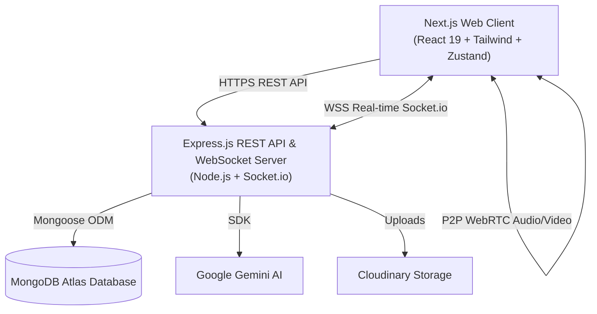

# ⚡ Nexus Chat

Nexus Chat is an ultra-fast, modern real-time messaging, WebRTC calling, and AI-assisted collaboration platform built on a clean monorepo architecture.

---

## 🏛️ System Architecture



---

## 📦 Project Structure

```
nexus-chat/
├── apps/
│   ├── web/                     # Next.js 15+ Frontend (React 19, Tailwind CSS, Radix UI)
│   │   ├── src/
│   │   │   ├── app/             # Next.js App Router (chat, settings, admin, auth)
│   │   │   ├── components/      # UI components (chat, call, ai, auth, ui)
│   │   │   ├── hooks/           # Custom React hooks (socket, webrtc, shortcuts)
│   │   │   ├── store/           # Zustand stores (auth, chat, theme, ui)
│   │   │   └── lib/             # API clients, socket utils, and helpers
│   │   └── next.config.mjs      # Next.js configuration & optimization
│   │
│   └── server/                  # Node.js + Express 5 Backend (Socket.io, Mongoose)
│       ├── src/
│       │   ├── config/          # Database, Cloudinary, Passport, & Env
│       │   ├── controllers/     # API route handlers
│       │   ├── middleware/      # Auth, sanitization, rate-limiting, error handling
│       │   ├── models/          # Mongoose database models (User, Chat, Message, Call)
│       │   ├── routes/          # Express REST API routes
│       │   ├── services/        # Business logic & AI integrations
│       │   ├── socket/          # Socket.io connection & event dispatchers
│       │   └── utils/           # JWT, crypto, response formatting
│       └── tsconfig.json
│
├── packages/
│   └── shared/                  # Shared TypeScript types, interfaces, & socket events
│       └── src/index.ts
│
├── render.yaml                  # Render.com Blueprint deployment config
└── package.json                 # Monorepo workspaces & scripts
```

---

## ✨ Features

- **💬 Real-Time Messaging:** Sub-millisecond message delivery via Socket.io with typing indicators, delivery checkmarks, double-read receipts, and emoji reaction bars.
- **📞 Peer-to-Peer Calls:** WebRTC-powered crystal-clear voice and video calling with Picture-in-Picture (PiP) and media toggles.
- **🤖 Built-in Gemini AI:** Context-aware smart reply suggestions, instant universal translation, and an in-app multi-turn AI assistant.
- **🎨 Chat Customization Suite:** Dynamic sent bubble colors (Emerald, Cobalt, Indigo, Rose, Amber, Carbon), custom wallpaper patterns (Dots, Grid, Lines), text size density, and corner geometry controls.
- **🛡️ Security & Privacy:** Granular privacy controls (Last Seen, Profile Photo, Read Receipts), TOTP Two-Factor Authentication (2FA), and user blocking/reporting.
- **📱 Fully Responsive:** Adaptive mobile master-detail chat navigation, `100dvh` virtual keyboard protection, and horizontal scrollable settings.
- **👑 Admin Control Center:** Platform overview stats, user moderation, ban management, and report auditing.

---

## 🚀 Quick Start (Local Development)

### 1. Prerequisites
- **Node.js**: v20+
- **MongoDB**: Local MongoDB or [MongoDB Atlas](https://www.mongodb.com/atlas) connection string

### 2. Install Dependencies & Build Shared Package
```bash
npm install
npm run build:shared
```

### 3. Setup Environment Variables
Copy `.env.example` to root `.env` and `apps/server/.env`:
```bash
cp .env.example .env
cp .env.example apps/server/.env
```

### 4. Start Development Servers
```bash
npm run dev
```
- **Web App:** [http://localhost:3000](http://localhost:3000) (or `3001`)
- **Backend API:** [http://localhost:4000](http://localhost:4000)
- **Swagger Docs:** [http://localhost:4000/api/docs](http://localhost:4000/api/docs)

---

## 🌐 Production Deployment

### Backend on [Render.com](https://render.com)
1. Create a **Web Service** pointing to `Redappleee/Nexus-Chat`.
2. Configure settings:
   - **Build Command:** `npm run build:server`
   - **Start Command:** `npm run start:server`
3. Add Environment Variables:
   - `NODE_ENV`: `production`
   - `MONGODB_URI`: `<your-mongodb-atlas-connection-string>`
   - `JWT_ACCESS_SECRET`: `<secure-random-string-32-chars>`
   - `JWT_REFRESH_SECRET`: `<secure-random-string-32-chars>`
   - `CLIENT_URL`: `https://<your-vercel-app>.vercel.app`

### Frontend on [Vercel.com](https://vercel.com)
1. Import repository on Vercel.
2. Set **Root Directory** to `apps/web`.
3. Set **Install Command** Override:
   ```bash
   cd ../.. && npm install && npm run build:shared
   ```
4. Add Environment Variables:
   - `NEXT_PUBLIC_API_URL`: `https://<your-render-app>.onrender.com/api/v1`
   - `NEXT_PUBLIC_SOCKET_URL`: `https://<your-render-app>.onrender.com`

---

## 🛠️ Monorepo Scripts

| Command | Action |
|---|---|
| `npm run dev` | Runs both backend API and frontend web app concurrently in watch mode |
| `npm run build` | Builds `@nexus/shared`, `@nexus/server`, and `@nexus/web` |
| `npm run build:server` | Builds shared package and compiles backend server TypeScript |
| `npm run build:web` | Compiles Next.js frontend production bundle |
| `npm run start:server` | Starts compiled Node.js backend server |
| `npm run typecheck` | Validates TypeScript across all workspace packages |
| `npm run lint` | Runs linter checks across all packages |
| `npm run kill-ports` | Kills lingering processes on dev ports (3001, 4000) |

---

## 📄 License
MIT License. Built for modern, high-performance real-time communication.
